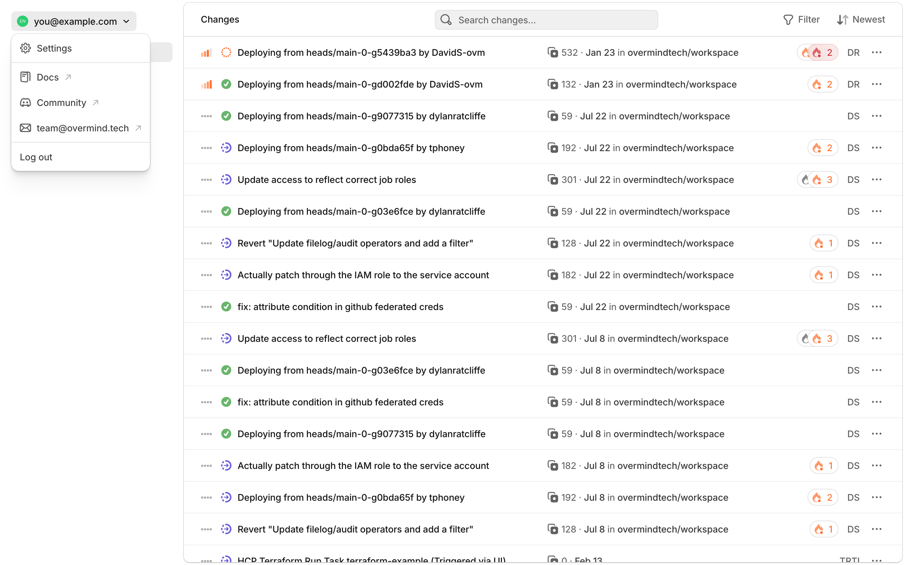
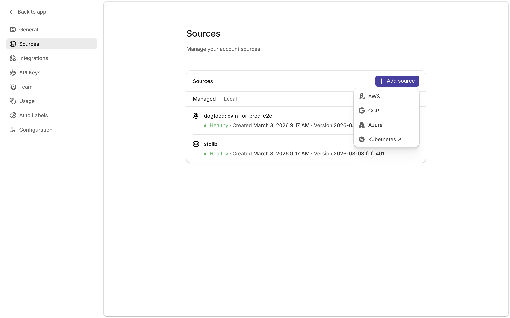
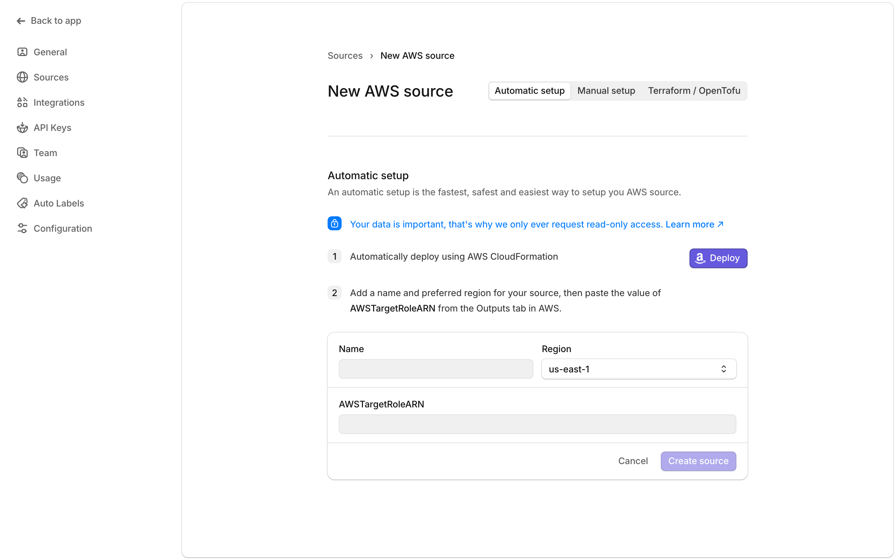

To be able to analyse and discover your infrastructure, Overmind requires read-only access to your AWS account. There are two ways to configure this:

- **Temporarily:** When you run the `overmind terraform` commands locally, the CLI uses the same AWS access that Terraform does to create a temporary local source. This gives Overmind access to AWS while the command is running, but not afterwards.
- **Permanently** (Recommended): This is known as a "Managed Source". Managed sources are always running and assume an IAM role that you create in your AWS account that gives them read-only AWS access.

## Configure a Managed Source

To create an AWS source, open [Settings](https://app.overmind.tech/settings) by clicking your avatar in the sidebar, then navigating to [Sources](https://app.overmind.tech/settings/sources).



Click **Add source** and select **AWS**.



Use "Deploy with AWS CloudFormation" to be taken to the AWS console. You may need to sign in and reload the page. With the results from the CloudFormation deployment, choose a name for your source (e.g. "prod") and fill in "Region" and "AWSTargetRoleARN".



Press "Create source" to finish the configuration.

## Manual Setup

To allow Overmind to access your infrastructure safely, you need to first configure a role and trust relationship that the Overmind AWS account can assume.

This role will be protected by an [external ID](https://docs.aws.amazon.com/IAM/latest/UserGuide/id_roles_create_for-user_externalid.html#external-id-purpose).

To create the role, open the AWS console for the account you wish to link to Overmind, then:

1. Open IAM
1. Click Roles
1. Click "Create role"
1. In "Trusted entity type" select "AWS account"
1. In "An AWS account" select "Another AWS account" and enter `942836531449`
1. (Optional, you can do this later) Tick "Require external ID". **Note:** Each source within Overmind has its own unique external ID. In order to find the external ID for a source go to Settings > Sources > Add Source > AWS > Manual Setup and copy the external ID from Step 3. Do not close this window after you have done this, you'll need it later
1. On the "Add permissions", don't select anything, just click "Next"
1. In "Role name" enter a descriptive name like `overmind-read-only`
1. Click "Create Role"

The next step is to assign permissions to this role. To do this open your newly created role, then:

1. Click "Add Permissions" > "Create inline policy"
1. Select JSON
1. Paste the following policy:

   ```json
   {
     "Version": "2012-10-17",
     "Statement": [
       {
         "Effect": "Allow",
         "Action": [
           "apigateway:Get*",
           "autoscaling:Describe*",
           "cloudfront:Get*",
           "cloudfront:List*",
           "cloudwatch:Describe*",
           "cloudwatch:GetMetricData",
           "cloudwatch:ListTagsForResource",
           "directconnect:Describe*",
           "dynamodb:Describe*",
           "dynamodb:List*",
           "ec2:Describe*",
           "ecs:Describe*",
           "ecs:List*",
           "eks:Describe*",
           "eks:List*",
           "elasticfilesystem:Describe*",
           "elasticloadbalancing:Describe*",
           "iam:Get*",
           "iam:List*",
           "kms:Describe*",
           "kms:Get*",
           "kms:List*",
           "lambda:Get*",
           "lambda:List*",
           "network-firewall:Describe*",
           "network-firewall:List*",
           "networkmanager:Describe*",
           "networkmanager:Get*",
           "networkmanager:List*",
           "rds:Describe*",
           "rds:ListTagsForResource",
           "route53:Get*",
           "route53:List*",
           "s3:GetBucket*",
           "s3:ListAllMyBuckets",
           "sns:Get*",
           "sns:List*",
           "sqs:Get*",
           "sqs:List*",
           "ssm:Describe*",
           "ssm:Get*",
           "ssm:ListTagsForResource"
         ],
         "Resource": "*"
       }
     ]
   }
   ```

1. Name the policy `overmind-read-only`
1. Click "Create policy"

At this point the permissions are complete, the last step is to copy the ARN of the role from the IAM console, and paste it back into Overmind, and create the source. The source will get a green tick once it's started and connected, which should take less than a minute.

## Check your sources

After you have configured a source, it'll show up in [Settings › Sources](https://app.overmind.tech/settings/sources). There you can check that the source is healthy.

## Explore your new data

Once your new source is healthy, jump over to the [Explore page](https://app.overmind.tech/explore?type=*&method=LIST&linkDepth=1) to show all your resources.
