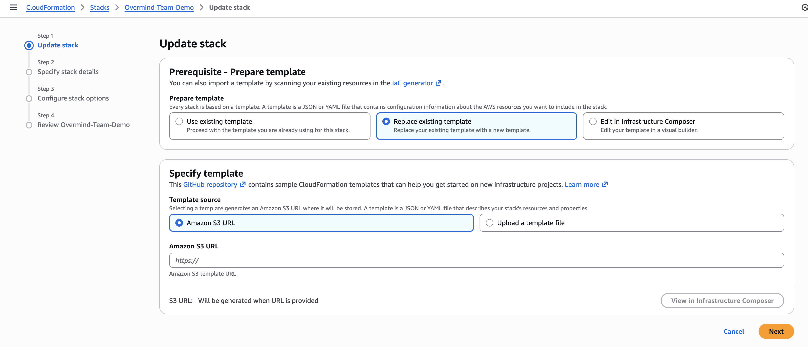

# Updating Your AWS IAM Role for Enhanced Security

Starting December 2025, we've enhanced how Overmind connects to your AWS infrastructure using **EKS Pod Identity**. This update improves security by using short-lived, automatically rotated credentials when accessing your AWS resources.

## Why This Update is Important

Previously, Overmind used static AWS credentials to assume the IAM role in your account. With EKS Pod Identity, we now use:

- **Short-lived credentials** that are automatically rotated
- **Session tagging** for better auditability and tracing
- **Reduced attack surface** with no long-lived credentials

To benefit from these security improvements, you need to update the IAM role trust policy in your AWS account to allow the `sts:TagSession` permission.

## How to Check if You Need to Update

You can check if your IAM role needs updating by looking at the version tag:

1. Open the **AWS IAM Console**
2. Navigate to **Roles** and find your Overmind role (usually named "Overmind" or "overmind-read-only")
3. Click on the role and go to the **Tags** tab
4. Look for the `overmind.version` tag

| Version Tag             | Status             |
| ----------------------- | ------------------ |
| `2025-12-01` or later   | ✅ Up to date      |
| `2023-03-14` or earlier | ⚠️ Update required |
| No tag                  | ⚠️ Update required |

## Update Instructions

### Option A: Update via CloudFormation (Recommended)

If you originally created your IAM role using our CloudFormation template, follow these steps:

#### Step 1: Open AWS CloudFormation Console

Go to the [AWS CloudFormation Console](https://console.aws.amazon.com/cloudformation) in the region where you deployed the Overmind stack.

#### Step 2: Select the Overmind Stack

Find and select the CloudFormation stack named **"Overmind"** (or "OvermindDevelopment" for development environments).

:::tip
Look for a stack named "Overmind" or "OvermindDevelopment" in the region where you originally deployed it.
:::

#### Step 3: Update the Stack

1. Click the **"Update"** button at the top of the page
2. Under "Prepare template", select **"Replace existing template"**
3. Under "Specify template", select **"Amazon S3 URL"**
4. Enter the template URL provided by Overmind (see below for how to find it)
5. Click **"Next"**



:::info Finding the CloudFormation Template URL
To get the latest CloudFormation template URL:

1. Go to [Overmind Settings > Sources](https://app.overmind.tech/settings/sources)
2. Click **Add Source > AWS**
3. Right-click the "Deploy" button and copy the link - the URL contains the `templateURL` parameter
:::

#### Step 4: Review and Apply

1. Keep the existing **External ID** parameter unchanged
2. Click **"Next"** through the configuration pages
3. On the review page, check the box acknowledging that CloudFormation might create IAM resources
4. Click **"Submit"**

The update typically takes less than a minute to complete.

### Option B: Manual Update

If you prefer to update the IAM role manually, or if you created the role without CloudFormation:

#### Step 1: Open IAM Console

Go to the [AWS IAM Console](https://console.aws.amazon.com/iam) and navigate to **Roles**.

#### Step 2: Find Your Overmind Role

Search for and select your Overmind role (usually named "Overmind" or the name you specified during setup).

#### Step 3: Edit the Trust Policy

1. Go to the **Trust relationships** tab
2. Click **"Edit trust policy"**
3. Add the following statement to the `Statement` array:

```json
{
  "Effect": "Allow",
  "Principal": {
    "AWS": "arn:aws:iam::944651592624:root"
  },
  "Action": "sts:TagSession"
}
```

Your complete trust policy should look like this:

```json
{
  "Version": "2012-10-17",
  "Statement": [
    {
      "Effect": "Allow",
      "Principal": {
        "AWS": "arn:aws:iam::944651592624:root"
      },
      "Action": "sts:AssumeRole",
      "Condition": {
        "StringEquals": {
          "sts:ExternalId": "YOUR-EXTERNAL-ID-HERE"
        }
      }
    },
    {
      "Effect": "Allow",
      "Principal": {
        "AWS": "arn:aws:iam::944651592624:root"
      },
      "Action": "sts:TagSession"
    }
  ]
}
```

1. Click **"Update policy"**

#### Step 4: Update the Version Tag (Optional)

To help track the version of your role configuration:

1. Go to the **Tags** tab
2. Add or update the tag:
   - **Key:** `overmind.version`
   - **Value:** `2025-12-01`

## Verification

After updating, your existing AWS sources will continue to work without interruption. The enhanced security features will be automatically enabled within the next few minutes.

You can verify the update was successful by:

1. Checking that your source shows a green status in [Overmind Settings > Sources](https://app.overmind.tech/settings/sources)
2. Verifying the role's `overmind.version` tag shows `2025-12-01` or later

## Frequently Asked Questions

### Will this cause any downtime?

No. The update adds a new permission without removing any existing permissions. Your sources will continue to work throughout the update process.

### What if I have multiple AWS accounts?

You'll need to update the IAM role in each AWS account where you have an Overmind source configured.

### What happens if I don't update?

Your sources will continue to work, but won't benefit from the enhanced security features provided by EKS Pod Identity. We strongly recommend updating for improved security posture.

### I'm using a different Overmind AWS account ID

If you're on a dedicated or on-premises deployment, the AWS account ID in the trust policy may be different. Contact your Overmind administrator for the correct account ID.

## Need Help?

If you encounter any issues during the update:

- Contact support at support@overmind.tech
