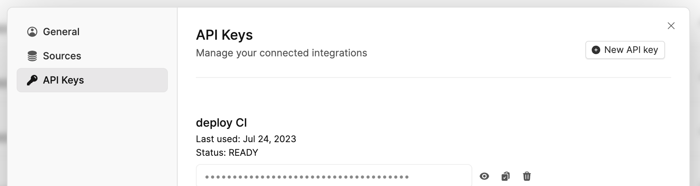

## Prerequisites

- Kubernetes 1.16+
- Helm 3.x
- An Overmind API key with `request:receive` scope

## Installation

Create an API Key with `request:receive` scope in Overmind under Account settings > API Keys




Install the source into your Kubernetes cluster using Helm:

```sh
helm repo add overmind https://dl.cloudsmith.io/public/overmind/tools/helm/charts
helm install overmind-kube-source overmind/overmind-kube-source \
  --set source.apiKey.value=YOUR_API_KEY \
  --set source.clusterName=my-cluster-name
```

## Uninstalling

```sh
helm uninstall overmind-kube-source
```

## Upgrading

```shell
helm upgrade overmind-kube-source overmind/overmind-kube-source
```

## Configuration

The following table lists the configurable parameters and their default values.

### Image Configuration

| Parameter          | Description                        | Default                                     |
| ------------------ | ---------------------------------- | ------------------------------------------- |
| `image.repository` | Image repository                   | `ghcr.io/overmindtech/workspace/k8s-source` |
| `image.pullPolicy` | Image pull policy                  | `Always`                                    |
| `image.tag`        | Image tag (defaults to appVersion) | `""`                                        |
| `imagePullSecrets` | Image pull secrets                 | `[]`                                        |

### Deployment Configuration

| Parameter            | Description                | Default |
| -------------------- | -------------------------- | ------- |
| `replicaCount`       | Number of replicas         | `1`     |
| `nameOverride`       | Override chart name        | `""`    |
| `fullnameOverride`   | Override full name         | `""`    |
| `podAnnotations`     | Pod annotations            | `{}`    |
| `podSecurityContext` | Pod security context       | `{}`    |
| `securityContext`    | Container security context | `{}`    |
| `nodeSelector`       | Node selector              | `{}`    |
| `tolerations`        | Pod tolerations            | `[]`    |
| `affinity`           | Pod affinity rules         | `{}`    |

### Source Configuration

| Parameter                          | Description                                           | Default                     |
| ---------------------------------- | ----------------------------------------------------- | --------------------------- |
| `source.log`                       | Log level (info, debug, trace)                        | `info`                      |
| `source.apiKey.value`              | Direct API key value (not recommended for production) | `""`                        |
| `source.apiKey.existingSecretName` | Name of existing secret containing API key            | `""`                        |
| `source.app`                       | Overmind instance URL                                 | `https://app.overmind.tech` |
| `source.maxParallel`               | Max parallel requests                                 | `20`                        |
| `source.rateLimitQPS`              | K8s API rate limit QPS                                | `10`                        |
| `source.rateLimitBurst`            | K8s API rate limit burst                              | `30`                        |
| `source.clusterName`               | Cluster name                                          | `""`                        |
| `source.honeycombApiKey`           | Honeycomb API key                                     | `""`                        |

### Pod Disruption Budget Configuration

| Parameter                     | Description                  | Default |
| ----------------------------- | ---------------------------- | ------- |
| `podDisruptionBudget.enabled` | Enable Pod Disruption Budget | `true`  |

### Example values.yaml

```yaml
source:
  apiKey: 'your-api-key'
  clusterName: 'production-cluster'
  log: 'debug'
  maxParallel: 30
  rateLimitQPS: 20
  rateLimitBurst: 40

# Pod Disruption Budget is enabled by default for production protection
podDisruptionBudget:
  enabled: true

resources:
  limits:
    cpu: 200m
    memory: 256Mi
  requests:
    cpu: 100m
    memory: 128Mi
```

## API Key Management

The chart provides two methods for managing the required Overmind API key:

### Using an Existing Secret

1. Create a Kubernetes secret containing your API key:

   ```sh
   kubectl create secret generic overmind-api-key \
       --from-literal=API_KEY=your-api-key-here
   ```

2. Install the chart:

   ```sh
   helm install overmind-kube-source overmind/overmind-kube-source \
       --set source.apiKey.existingSecretName=overmind-api-key
   ```

**Important Notes:**

- The secret MUST contain a key named `API_KEY`
- The secret must exist in the same namespace as the chart
- Installation will fail if:
  - The secret doesn't exist
  - The secret exists but doesn't contain an `API_KEY` key
  - Neither `source.apiKey.existingSecretName` nor `source.apiKey.value` is provided

### Using Direct Value

```sh
helm install overmind-kube-source overmind/overmind-kube-source \
  --set source.apiKey.value=YOUR_API_KEY
  --set source.clusterName=my-cluster-name
```

**Warning:** This method stores the API key in clear text in your values file. Only use for development/testing.

## Support

This source will support all Kubernetes versions that are currently maintained in the kubernetes project. The list can be found [here](https://kubernetes.io/releases/)
